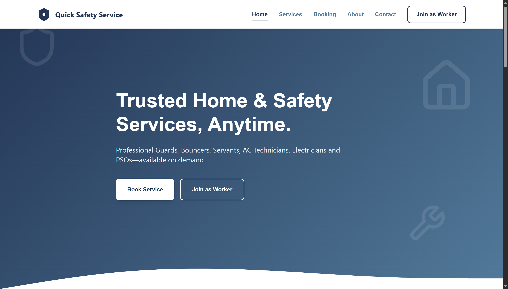
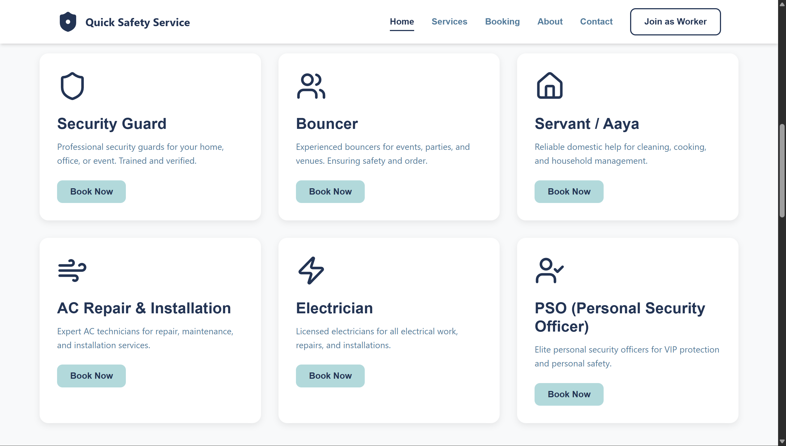

# 🚨 Quick Safety Service  
A fast, responsive, and modern service-booking website offering **Security Guards, Bouncers, Servants/Aaya, AC Repair, Electricians, and PSO services**.  
This platform acts as an official **booking medium** for our service team — all services are fulfilled directly by Quick Safety Service.

---

## 📸 Project Preview

### Main Screenshot


### Additional Preview


---

## 🚀 Features

### 🔹 Customer-Focused
- Clean, modern, high-conversion landing page  
- Fully responsive across mobile, tablet & desktop  
- Fast-loading Vite setup  
- Easy-to-use service categories  
- Smooth layout & styling  

### 🔹 Business Services Offered
- 🛡️ Security Guards  
- 💪 Bouncers (Events/Clubs)  
- 👩‍🍼 Servants / Aaya / Attendants  
- ❄️ AC Repair & Installation  
- 🔌 Electricians  
- 🔰 PSO (Personal Security Officers)  

---

## 🧩 Tech Stack

- **Vite**
- **HTML5**
- **CSS3 / Tailwind (if used)**
- **JavaScript**
- **Node.js**
- **Vercel** (for deployment)

---

## 📂 Project Structure

QuickSafetyService/
│── src/
│── image.png
│── imag2.png
│── index.html
│── package.json
│── package-lock.json
│── vite.config.ts
│── node_modules/
│── README.md


---

## 📦 Installation & Setup

### 1️⃣ Clone the repository
```sh
git clone <your-repo-url>
cd QuickSafetyService

# Install dependencies
npm install

# Start development server
npm run dev
